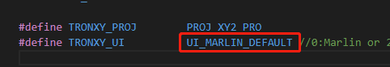
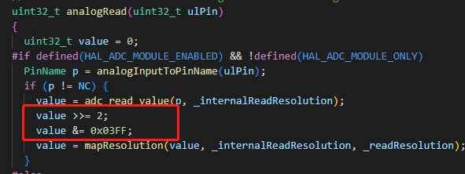

## Applicable printers

  X5SA600

## How to compile

  1. Install [vscode](https://code.visualstudio.com/), and install platformio plugin in the vscode extension.
  2. Download this firmware and unzip it, you will get a firmware folder. Run vscode -> file -> Open Folder, select the firmware folder, open it.
  3. Compile the firmware. The first compilation may take a long time. The compiled target file is placed in the 'update' folder
  4. Copy the 'update' folder into the root directory of the SD card, insert the card into the printer, restart, and the machine will automatically update the firmware. After that, the machine will run the current firmware.

## FAQ

  1. If you want to switch back to the original interface of Marlin, just define "#define TRONXY_UI" in "Marlin/TronxyMachine.h" as UI_MARLIN_DEFAULT
  - Note: Remember the current UI name, otherwise, when you want to switch back to the factory interface, you will forget which UI it is, because different UI    correspond to different resolution screens. If you switch incorrectly, an exception will be displayed.

  2. When you burn the firmware you compiled into the machine and report an error all the time, you should pay attention to: by default, the main control chip corresponding to this firmware is STM32F446ZET, but in fact, because another chip GD32F4 may be used on the same machine, you need to confirm which chip your machine is.There are two confirmation methods:
  - First, enter System ->Info to view. If there is 'GD32' in it, it means GD32 series chips. If there is no GD32, it means STM32 series chips
  - Second, open the chassis directly and check the screen print of the main control chip on the control board, which will be marked with GD32 or STM32

    When GD32 series chips are confirmed, you need to modify:
    - In the "platformio.ini" file, find Section [my_board], where there is a "DMCU_TYPE=0", change it to "DMCU_TYPE=4"
    - In the platformio installation directory, find .platformio\packages\framework-arduinoststm32\cores\arduino\wiring_analog.c, find function: uint32_t analogRead(uint32_t ulPin),Add two statements under the statement "value = adc_read_value(p, _internalReadResolution)":value >>= 2;value &= 0x03FF;

    After modification, recompile and burn. At this time, it becomes the firmware of GD32
  
  3. If you encounter problems like " multiple definition of 'EXTI1_IRQHandler' " as shown below, please find the location of the file in the figure below

    open the file and comment out “void EXTI1_IRQHandler(void)”(according to the error message) function, as shown in the figure.

## Other
The latest version can be found at[Marlin on github](https://github.com/MarlinFirmware)

